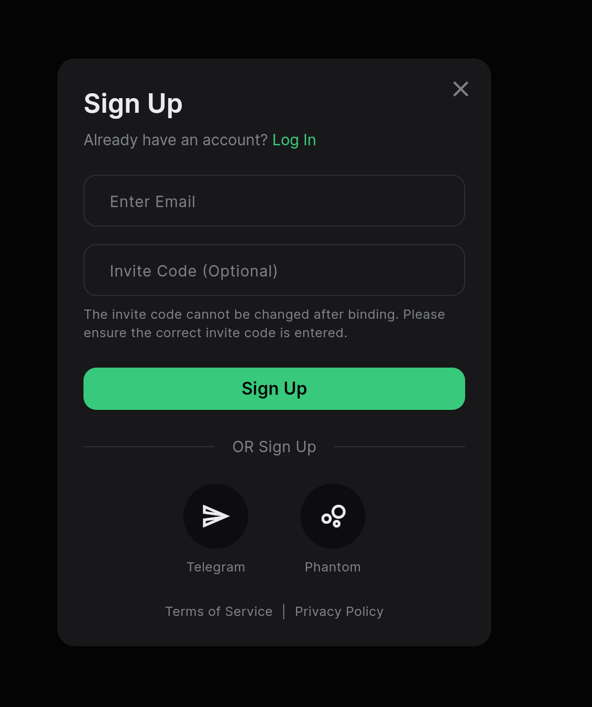
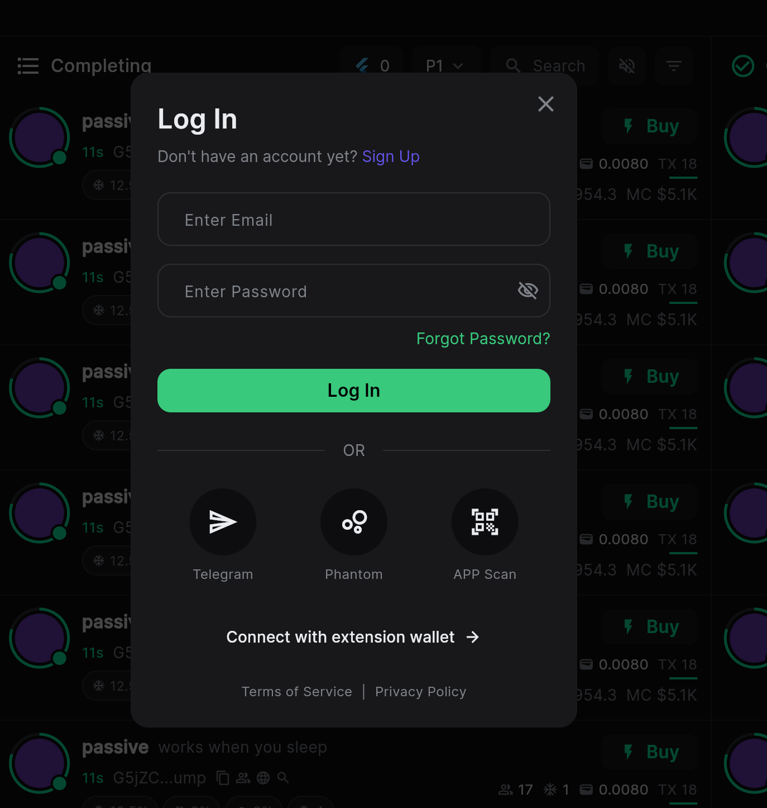
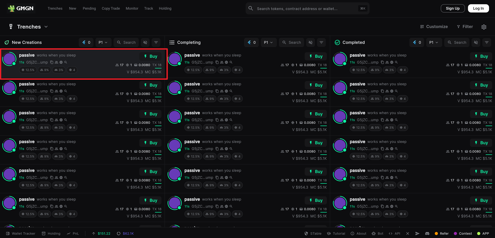
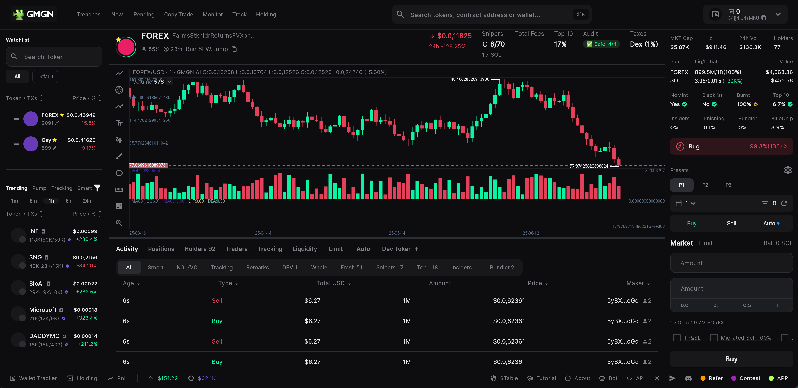
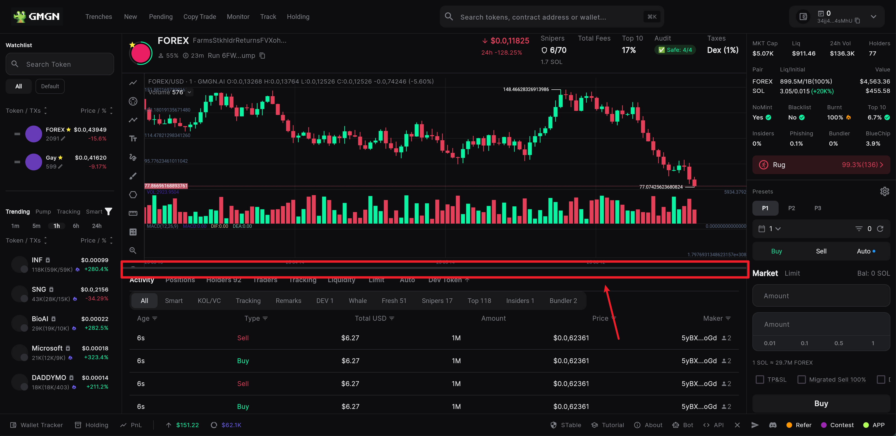
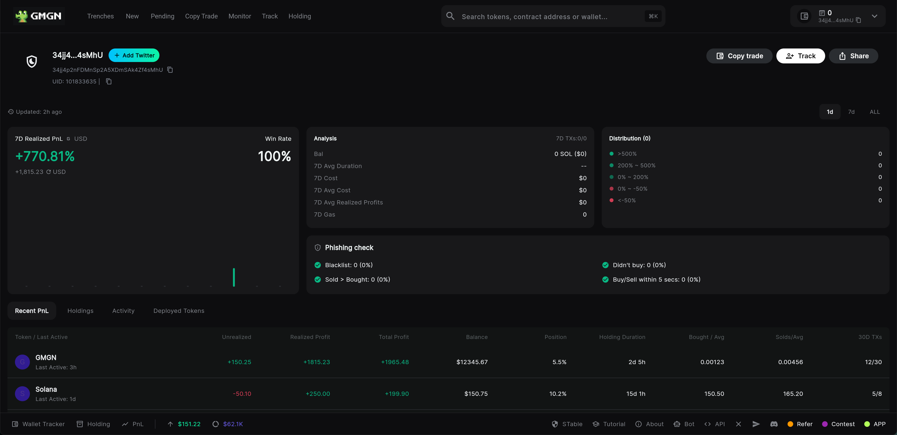
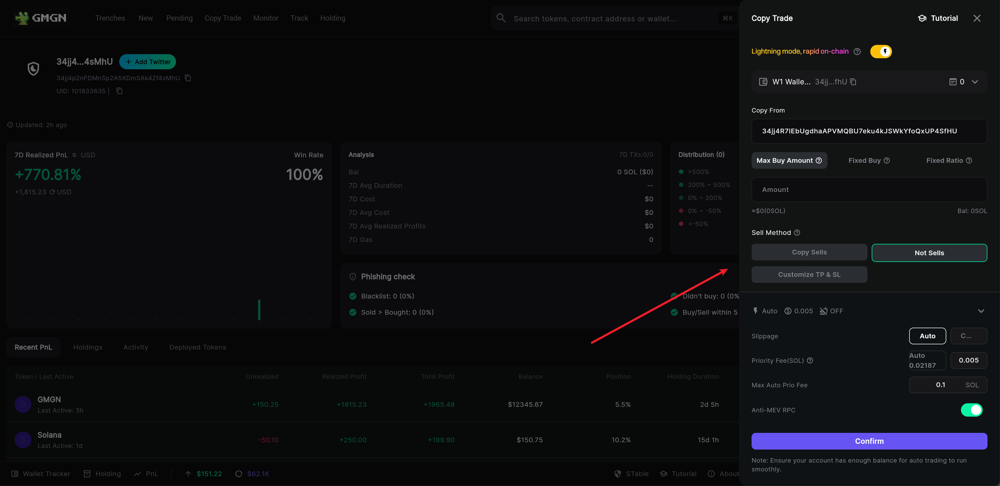
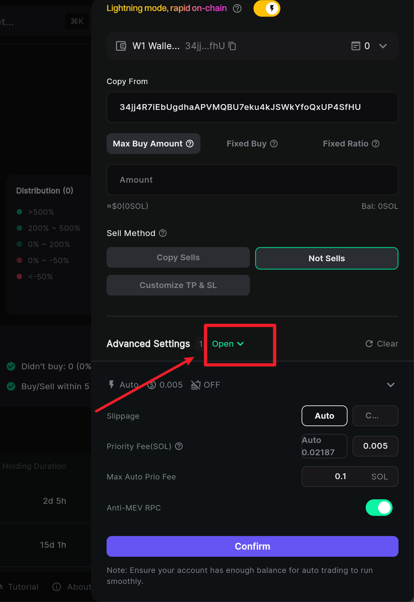

# GMGN.AI Flutter 复刻版

<div align="center">

# 📱 GMGN.ai Clone

一个使用 Flutter 开发的 GMGN.AI 网站复刻版，主要用于学习和演示目的。

[🇺🇸 English](README_EN.md) | 🇨🇳 中文

[](https://flutter.dev)
[](https://dart.dev)

</div>

## 📖 项目简介

本项目是对 [GMGN.AI](https://gmgn.ai) 网站的 Flutter UI 复刻版，**仅实现了界面展示效果**，主要用于学习 Flutter 开发技术。项目采用现代化的 Flutter 开发框架，实现了响应式设计和流畅的用户体验。

🌐 **在线体验：** [https://liyincode.github.io/gmgn_clone/](https://liyincode.github.io/gmgn_clone/)

**⚠️ 重要说明：** 
- 🎨 **纯 UI 展示项目** - 仅复刻了界面设计，无实际业务功能
- 📊 **所有数据均为 Mock 数据** - 价格、交易记录、用户信息等均为静态模拟数据
- 🚫 **功能不可用** - 登录、交易、钱包等功能仅为界面演示，无实际效果
- 📚 **学习目的** - 本项目仅用于学习 Flutter 开发和 UI 设计，不涉及任何商业用途

## ⚖️ 免责声明 

**仅供教育学习使用**

本项目是对 gmgn.ai 网站的界面复刻，仅用于个人学习和 Flutter 技能展示。本项目为非商业项目，与 gmgn.ai 无任何关联、赞助或认可关系。

原始设计、品牌和概念的所有知识产权均归 gmgn.ai 所有。本项目仅实现前端界面展示，使用模拟数据，无任何实际功能。

向 gmgn.ai 的优秀团队致敬。

## ✨ UI 界面展示功能

> **注意：以下均为界面展示效果，无实际功能**

### 🔐 用户认证界面
- 🎨 用户注册弹窗界面
- 🎨 用户登录弹窗界面  
- 🎨 用户状态切换展示
- 🎨 模拟钱包地址显示

 

### 📊 市场数据界面
- 🎨 代币价格列表界面
- 🎨 涨跌幅视觉效果
- 🎨 搜索筛选界面组件
- 🎨 代币详情页面布局



### 📈 交易分析界面
- 🎨 K线图表组件集成
- 🎨 图表大小调整交互
- 🎨 交易活动列表展示
- 🎨 持仓分析界面布局

 

### 💼 钱包界面
- 🎨 资产概览界面设计
- 🎨 盈亏数据展示效果
- 🎨 持仓列表界面布局
- 🎨 交易历史界面组件



### 🔄 复制交易界面
- 🎨 侧边抽屉交互效果
- 🎨 参数设置表单界面
- 🎨 高级设置展开效果
- 🎨 确认提示界面

 

## 🛠 技术栈

### 核心框架
- **Flutter** `^3.9.0` - 跨平台移动应用开发框架
- **Dart** `^3.9.0` - 编程语言

### 状态管理
- **Provider** `^6.1.5` - 状态管理解决方案

### UI 组件
- **Google Fonts** `^6.2.1` - 字体库
- **K Chart** `^0.7.1` - K线图表组件
- **Cupertino Icons** `^1.0.8` - iOS 风格图标

### 开发工具
- **Flutter Lints** `^5.0.0` - 代码规范检查

## 📱 支持平台

- ✅ **Web** - 浏览器 Web 应用 ([在线体验](https://liyincode.github.io/gmgn_clone/))
- ⚠️ **Android** - 理论支持，未测试
- ⚠️ **iOS** - 理论支持，未测试
- ⚠️ **Windows** - 理论支持，未测试
- ⚠️ **macOS** - 理论支持，未测试
- ⚠️ **Linux** - 理论支持，未测试

> **注意：** 目前只有 Web 版本经过完整测试，其他平台虽然 Flutter 理论上支持，但未进行实际测试验证。

## 🚀 快速开始

### 在线体验（推荐）

🌐 **直接访问：** [https://liyincode.github.io/gmgn_clone/](https://liyincode.github.io/gmgn_clone/)

无需安装任何环境，直接在浏览器中体验完整的 UI 界面。

### 本地运行

#### 环境要求

- Flutter SDK >= 3.9.0
- Dart SDK >= 3.9.0
- Android Studio / VS Code (推荐)
- Git

#### 安装步骤

1. **克隆项目**
```bash
git clone <repository-url>
cd gmgn_app
```

2. **安装依赖**
```bash
flutter pub get
```

3. **运行项目**
```bash
# 推荐：在浏览器中运行（已测试）
flutter run -d chrome

# 其他平台运行（未测试）
flutter run                    # 默认设备
flutter run -d macos           # macOS
flutter run -d windows         # Windows
flutter run -d linux           # Linux
```

4. **构建应用**
```bash
# Web 构建（已测试）
flutter build web

# 其他平台构建（未测试）
flutter build apk              # Android APK
flutter build ios              # iOS
flutter build windows          # Windows
flutter build macos            # macOS
```

## 📁 项目结构

```
lib/
├── data/           # 模拟数据
├── models/         # 数据模型
│   ├── market_coin.dart
│   ├── trader.dart
│   ├── user.dart
│   └── wallet_asset.dart
├── screens/        # 页面组件
│   ├── main/       # 主页面
│   ├── detail/     # 详情页面
│   ├── wallet/     # 钱包页面
│   ├── login/      # 登录页面
│   └── copy_trade/ # 复制交易
├── services/       # 业务逻辑
│   └── auth_service.dart
├── theme/          # 主题配置
│   ├── app_colors.dart
│   └── app_text_styles.dart
├── utils/          # 工具类
├── widgets/        # 通用组件
└── main.dart       # 应用入口
```

## 🎨 设计特色

### 深色主题
- 🎨 现代化深色 UI 设计
- 🌈 精心调配的颜色系统
- ✨ 流畅的动画效果

### 响应式设计
- 📱 移动端优先设计
- 💻 桌面端适配
- 🖥 Web 端兼容

### 用户体验
- ⚡ 快速响应的交互
- 🔄 平滑的页面切换
- 📊 直观的数据可视化

## 🔧 开发说明

### 项目特点
- 🎨 **纯前端 UI 项目** - 专注于界面展示和交互效果
- 📊 **Mock 数据驱动** - 所有数据来源于 `lib/data/mock_data.dart`
- 🚫 **无后端服务** - 不涉及真实的 API 调用或数据持久化

### 状态管理
项目使用 Provider 进行状态管理，主要包括：
- `AuthService` - 模拟用户认证状态切换
- 其他状态均为静态数据展示

### 主题系统
- `AppColors` - 统一的颜色定义，完全复刻原网站配色
- `AppTextStyles` - 统一的文字样式，使用 Google Fonts
- 深色主题设计，符合现代 UI 趋势

### 组件架构
- 页面级组件 (`screens/`) - 各个主要界面
- 通用组件 (`widgets/`) - 可复用的 UI 组件
- 模块化设计便于学习和维护

## 📚 学习资源

### Flutter 开发
- [Flutter 官方文档](https://flutter.dev/docs)
- [Dart 语言指南](https://dart.dev/guides)
- [Provider 状态管理](https://pub.dev/packages/provider)

### UI 设计学习
- [Material Design 指南](https://material.io/design)
- [Flutter UI 组件库](https://flutter.dev/docs/development/ui/widgets)

## 📄 许可证

本项目仅用于学习和技术演示目的，不涉及商业用途。

**法律声明：**
- 本项目与 gmgn.ai 官方无任何关联
- 所有原始设计版权归 gmgn.ai 所有
- 仅供学习 Flutter 开发技术使用
- 不得用于任何商业用途
- 使用者应自行承担使用风险

---

<div align="center">

**⭐ 如果这个项目对你有帮助，请给它一个 Star！**

Made with ❤️ using Flutter

</div>
