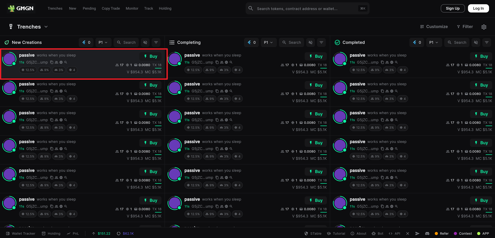
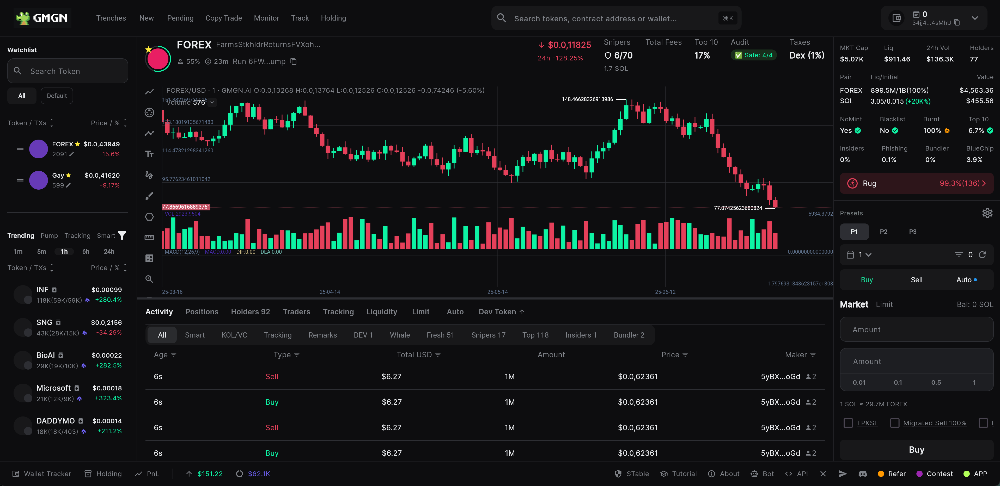
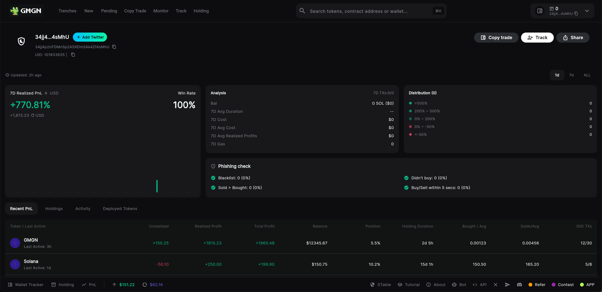

<div align="center">

# 📱 GMGN.ai Clone

A Flutter UI clone of the GMGN.AI website, built for learning and demonstration purposes.

🇺🇸 English | [🇨🇳 中文](README.md)

[](https://flutter.dev)
[](https://dart.dev)

</div>

## 📖 Project Overview

This project is a Flutter UI clone of the [GMGN.AI](https://gmgn.ai) website, **implementing only the interface display effects**, primarily for learning Flutter development techniques. The project uses modern Flutter development framework to achieve responsive design and smooth user experience.

🌐 **Live Demo:** [https://liyincode.github.io/gmgn_clone/](https://liyincode.github.io/gmgn_clone/)

**⚠️ Important Notes:** 
- 🎨 **Pure UI Display Project** - Only replicates interface design, no actual business functionality
- 📊 **All Data is Mock Data** - Prices, trading records, user information are all static simulated data
- 🚫 **Non-functional** - Login, trading, wallet functions are for interface demonstration only, no actual effects
- 📚 **Learning Purpose** - This project is solely for learning Flutter development and UI design, not for any commercial use

## ⚖️ Disclaimer

**For Educational Purposes Only**

This project is a UI clone of the gmgn.ai web application, created solely for personal learning and skill demonstration in Flutter. It is a non-commercial project and is not affiliated with, sponsored by, or endorsed by gmgn.ai.

All intellectual property rights for the original design, brand, and concept belong to gmgn.ai. This project only implements the front-end interface with mock data and has no real functionality.

Credit goes to the talented team at gmgn.ai.

## ✨ UI Interface Display Features

> **Note: All features below are interface demonstrations only, with no actual functionality**

### 🔐 User Authentication Interface
- 🎨 User registration popup interface
- 🎨 User login popup interface  
- 🎨 User state switching display
- 🎨 Mock wallet address display

 

### 📊 Market Data Interface
- 🎨 Token price list interface
- 🎨 Price change visual effects
- 🎨 Search and filter interface components
- 🎨 Token detail page layout



### 📈 Trading Analysis Interface
- 🎨 K-line chart component integration
- 🎨 Chart size adjustment interaction
- 🎨 Trading activity list display
- 🎨 Position analysis interface layout

 

### 💼 Wallet Interface
- 🎨 Asset overview interface design
- 🎨 Profit and loss data display effects
- 🎨 Holdings list interface layout
- 🎨 Trading history interface components



### 🔄 Copy Trading Interface
- 🎨 Side drawer interaction effects
- 🎨 Parameter setting form interface
- 🎨 Advanced settings expansion effects
- 🎨 Confirmation prompt interface

 

## 🛠 Tech Stack

### Core Framework
- **Flutter** `^3.9.0` - Cross-platform mobile app development framework
- **Dart** `^3.9.0` - Programming language

### State Management
- **Provider** `^6.1.5` - State management solution

### UI Components
- **Google Fonts** `^6.2.1` - Font library
- **K Chart** `^0.7.1` - K-line chart component
- **Cupertino Icons** `^1.0.8` - iOS style icons

### Development Tools
- **Flutter Lints** `^5.0.0` - Code style checking

## 📱 Supported Platforms

- ✅ **Web** - Browser web application ([Live Demo](https://liyincode.github.io/gmgn_clone/))
- ⚠️ **Android** - Theoretically supported, not tested
- ⚠️ **iOS** - Theoretically supported, not tested
- ⚠️ **Windows** - Theoretically supported, not tested
- ⚠️ **macOS** - Theoretically supported, not tested
- ⚠️ **Linux** - Theoretically supported, not tested

> **Note:** Currently only the Web version has been fully tested. Other platforms are theoretically supported by Flutter but have not been actually tested.

## 🚀 Quick Start

### Online Experience (Recommended)

🌐 **Direct Access:** [https://liyincode.github.io/gmgn_clone/](https://liyincode.github.io/gmgn_clone/)

No need to install any environment, experience the complete UI interface directly in your browser.

### Local Development

#### Requirements

- Flutter SDK >= 3.9.0
- Dart SDK >= 3.9.0
- Android Studio / VS Code (recommended)
- Git

#### Installation Steps

1. **Clone the project**
```bash
git clone <repository-url>
cd gmgn_app
```

2. **Install dependencies**
```bash
flutter pub get
```

3. **Run the project**
```bash
# Recommended: Run in browser (tested)
flutter run -d chrome

# Other platform runs (untested)
flutter run                    # Default device
flutter run -d macos           # macOS
flutter run -d windows         # Windows
flutter run -d linux           # Linux
```

4. **Build application**
```bash
# Web build (tested)
flutter build web

# Other platform builds (untested)
flutter build apk              # Android APK
flutter build ios              # iOS
flutter build windows          # Windows
flutter build macos            # macOS
```

## 📁 Project Structure

```
lib/
├── data/           # Mock data
├── models/         # Data models
│   ├── market_coin.dart
│   ├── trader.dart
│   ├── user.dart
│   └── wallet_asset.dart
├── screens/        # Page components
│   ├── main/       # Main page
│   ├── detail/     # Detail page
│   ├── wallet/     # Wallet page
│   ├── login/      # Login page
│   └── copy_trade/ # Copy trading
├── services/       # Business logic
│   └── auth_service.dart
├── theme/          # Theme configuration
│   ├── app_colors.dart
│   └── app_text_styles.dart
├── utils/          # Utilities
├── widgets/        # Common components
└── main.dart       # App entry point
```

## 🎨 Design Features

### Dark Theme
- 🎨 Modern dark UI design
- 🌈 Carefully crafted color system
- ✨ Smooth animation effects

### Responsive Design
- 📱 Mobile-first design
- 💻 Desktop adaptation
- 🖥 Web compatibility

### User Experience
- ⚡ Fast responsive interactions
- 🔄 Smooth page transitions
- 📊 Intuitive data visualization

## 🔧 Development Notes

### Project Characteristics
- 🎨 **Pure Frontend UI Project** - Focuses on interface display and interaction effects
- 📊 **Mock Data Driven** - All data comes from `lib/data/mock_data.dart`
- 🚫 **No Backend Services** - No real API calls or data persistence

### State Management
The project uses Provider for state management, mainly including:
- `AuthService` - Mock user authentication state switching
- Other states are static data displays

### Theme System
- `AppColors` - Unified color definitions, completely replicating original website colors
- `AppTextStyles` - Unified text styles using Google Fonts
- Dark theme design following modern UI trends

### Component Architecture
- Page-level components (`screens/`) - Main interfaces
- Common components (`widgets/`) - Reusable UI components
- Modular design for easy learning and maintenance

## 📚 Learning Resources

### Flutter Development
- [Flutter Official Documentation](https://flutter.dev/docs)
- [Dart Language Guide](https://dart.dev/guides)
- [Provider State Management](https://pub.dev/packages/provider)

### UI Design Learning
- [Material Design Guidelines](https://material.io/design)
- [Flutter UI Widget Catalog](https://flutter.dev/docs/development/ui/widgets)

## 📄 License

This project is for learning and technical demonstration purposes only, not for commercial use.

**Legal Statement:**
- This project has no affiliation with gmgn.ai official
- All original design copyrights belong to gmgn.ai
- For learning Flutter development techniques only
- Not to be used for any commercial purposes
- Users assume all risks of use

---

<div align="center">

**⭐ If this project helps you, please give it a Star!**

Made with ❤️ using Flutter

</div> 
