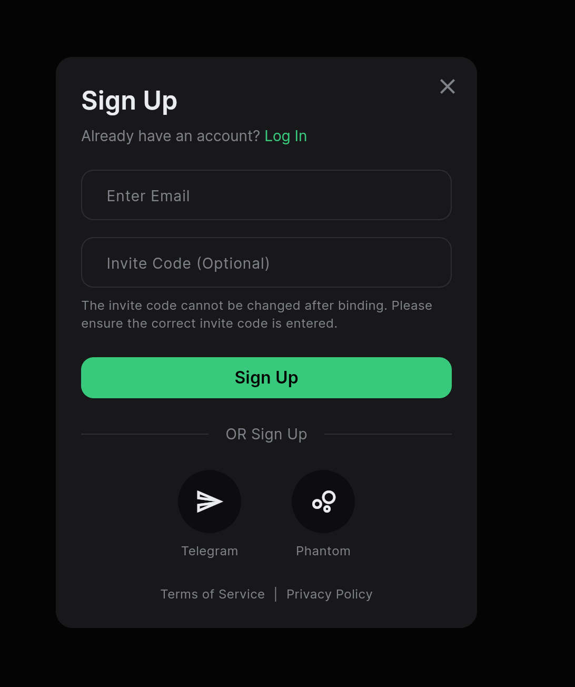
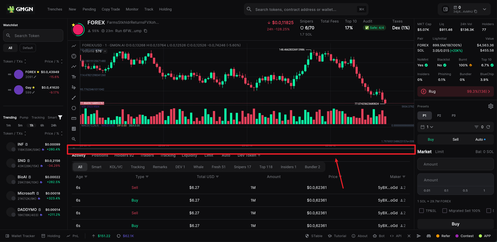
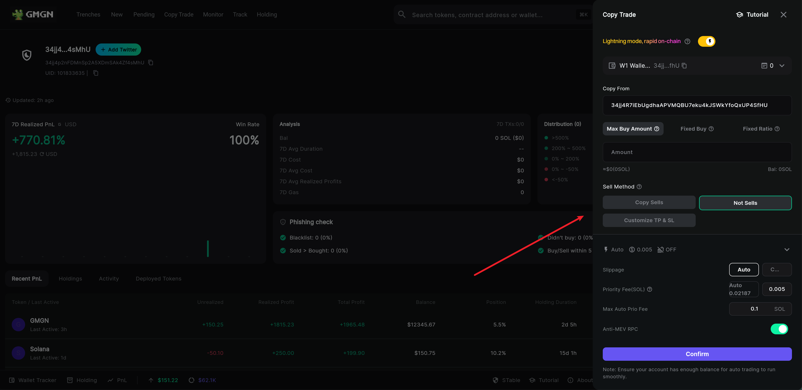

# GMGN.AI 复刻版 - UX流程文档

## 主要页面线框图 & 交互流程

### 流程1: 用户注册

**交互流程:**
1.  **初始状态**: 用户进入应用，页面右上角显示“Sign Up”按钮。

2.  **触发注册**: 用户点击“Sign Up”按钮。

3.  **弹出对话框**: 屏幕中央以淡入效果弹出注册弹框。

4.  **完成认证**: 用户输入信息并点击“Sign Up”按钮，按钮显示加载动画。成功后，对话框关闭，页面右上角更新为显示用户钱包信息的组件。

### 流程2：用户登录

**交互流程描述:**
1.  **初始状态**: 用户进入应用，页面右上角显示“Log In”按钮。

2.  **触发登录**: 用户点击“Log In”按钮。

3.  **弹出对话框**: 屏幕中央以淡入效果弹出登录弹框。

4. **触发注册**: 用户点击注册弹框中的“Sign Up”按钮。

4.  **完成认证**: 用户输入信息并点击“Log In”按钮，按钮显示加载动画。成功后，对话框关闭，页面右上角更新为显示用户钱包信息的组件。

### 流程3: 点击 token 详情

**交互流程:**
1.  **触发点击**: 用户点击 token 列表中的卡片。

2.  **进入详情**: 进入详情页面  

3.  **调整 k 线图大小**: 拖动 k 线图的边框，调整 k 线图大小。

### 流程4: 钱包概览

**交互流程:**
1.  **触发**: 用户登录后，点击 `MainHeader` 右上角的用户信息区域，弹出下拉菜单。

2.  **进入钱包**: 用户点击菜单中的“My Wallet”选项。

3.  **钱包概览**: 展示用户的资产概览、分析卡片和持仓列表。

### 流程5: 复制交易

**交互流程:**
1.  **触发**: 用户点击钱包概览中的“Copy trade”按钮。

2.  **进入复制交易**: 抽屉从屏幕右侧平滑进入，展示“复制交易”的设置表单。

3.  **设置参数**: 用户在抽屉内填写或选择所有必要的交易参数，点击 open 可以打开高级设置。
 
4.  **确认设置**: 用户点击抽屉底部的“Confirm”按钮。

5.  **反馈与关闭**: 抽屉关闭，同时屏幕底部滑出一个绿色的 `SnackBar`，提示“设置已成功保存”。用户流程结束。

